# Sound Manager Guide

You can import the sample **K-pop Festival** from Package Manager to quickly understand how things work, since it already includes ready-to-use `SoundManagerSO` and `SoundClipSO`.

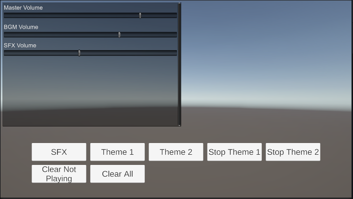

---

_Before following this guide, please delete the **K-pop Festival** sample to avoid conflicts when creating a new `SoundManagerSO`._

---

## 1. Step 1
Find the prefab named **SoundManager** and drag it into your Scene.

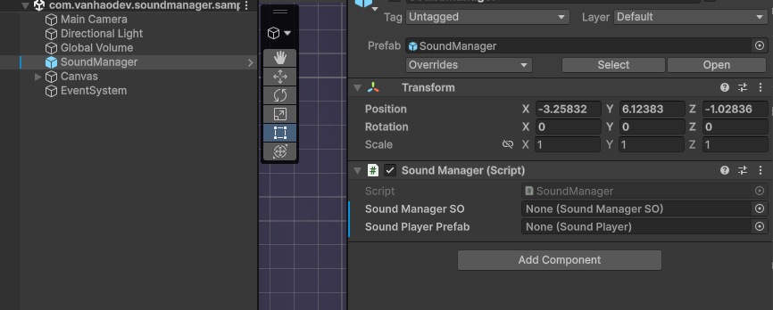

_You can also create an empty GameObject and manually add the `SoundManager` component instead of using the prefab._

---

## 2. Step 2
Right-click in any folder → Create a new **SoundManagerSO**

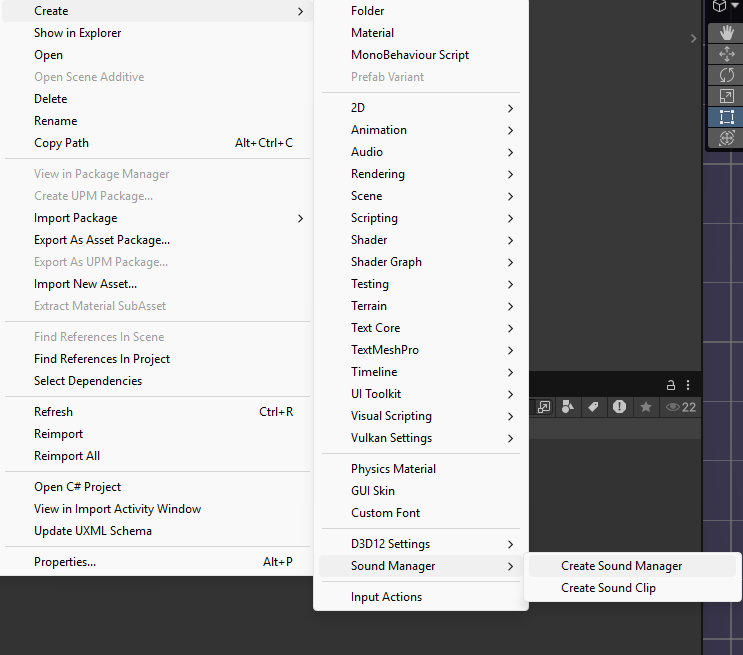

_A new `SoundManagerSO` will appear in your folder_

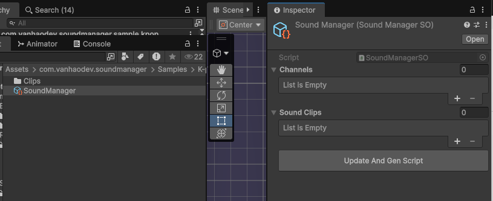

_Add 2 channels: **Music** and **SFX**, then click **Update And Gen Script**_

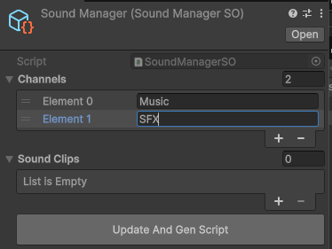

---

## 3. Step 3
Now create a `SoundClipSO` to store your sound/music.

Right-click in any folder → Create **SoundClipSO**

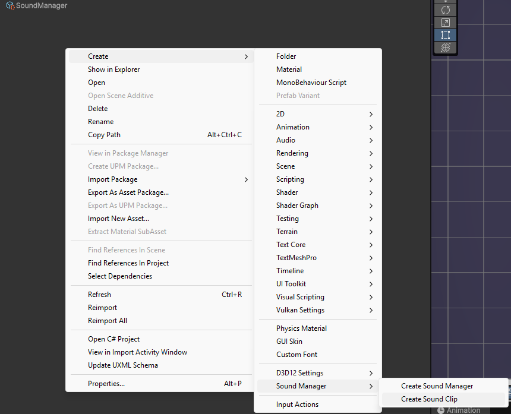

_Add your audio clip and rename the SO to something easy to remember_

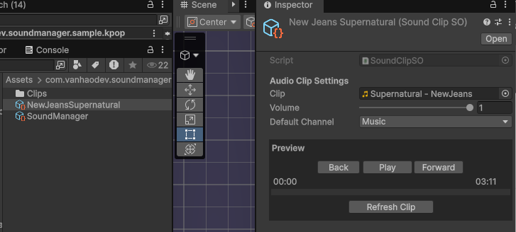

_Click **Refresh Clip** to preview the sound_

**Fields explanation:**
1. **Load Type**: How to load the audio clip (see [Audio Load Types](#audio-load-types) section)
2. **Audio Clip / Resources Path / Addressable Reference**: Depends on Load Type
3. **Volume**: Adjust the volume of this clip  
   - Example: background sounds (like birds) should be lower than 1  
4. **Default Channel**:  
   - Groups sounds into channels (Music, SFX, etc.)  
   - Sounds in the same channel share the same volume control  

**Dynamic channel example:**
- You create an explosion sound and set default channel = SFX  
- Later, you add a new channel called `UISound`  
- In a shop UI, you want to preview the explosion sound  
→ You can play it using `UISound` instead of SFX at runtime  

---

## 4. Step 4
Add your `SoundClipSO` (e.g. *NewJeansSupernatural*) into the sound library inside `SoundManagerSO`, then click **Update And Gen Script**

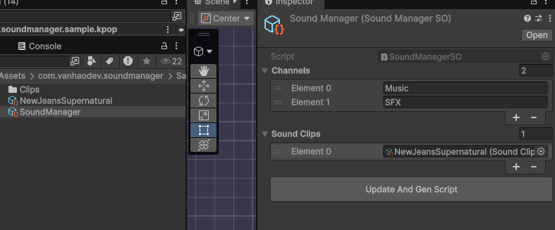

_This will generate/update 2 enum scripts:_

- `SoundChannelType`
- `SoundLibraryNameType`

```csharp
public enum SoundChannelType
{
    Music = 0,
    SFX = 1,
}
````

```csharp
public enum SoundLibraryNameType
{
    NewJeansSupernatural = 0,
}
```

*This means your system now has 2 channels and 1 sound clip ready to use.*

---

## 5. Step 5

Go back to the Scene and assign your `SoundManagerSO` to the **SoundManager** component.

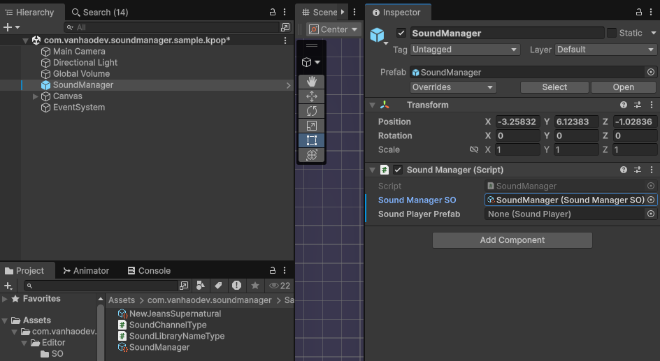

*You will see that `SoundManager` still needs a `SoundPlayer` prefab.*

### Create SoundPlayer prefab:

1. Create a new GameObject → rename it to **SoundPlayer**

   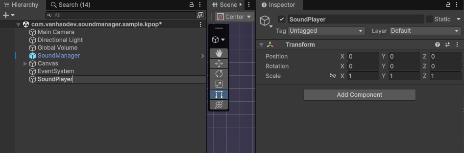

2. Add component → **Audio Source**

   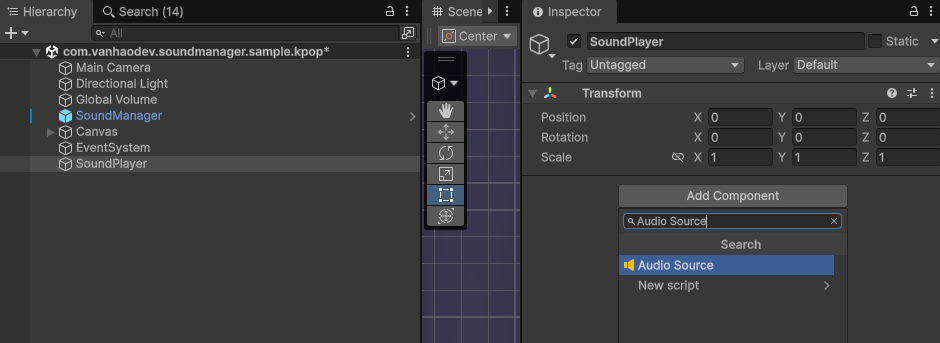

3. Add component → **SoundPlayer**

   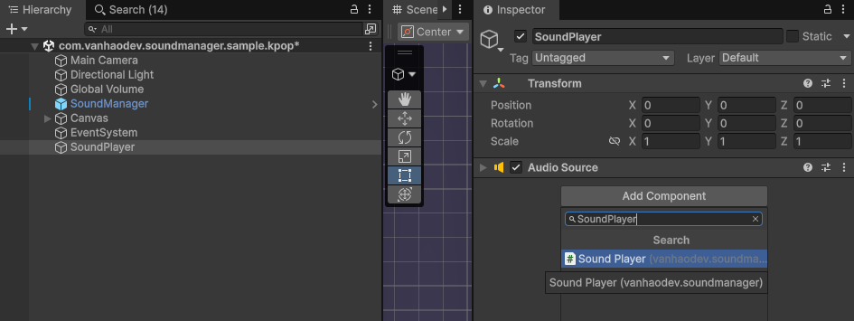

4. Drag **Audio Source** into the **Audio Source** field of `SoundPlayer`

   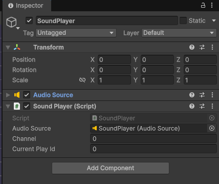

5. Drag this GameObject into a folder to create a prefab

   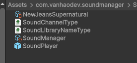

6. Delete it from the Scene (the prefab is already saved)

   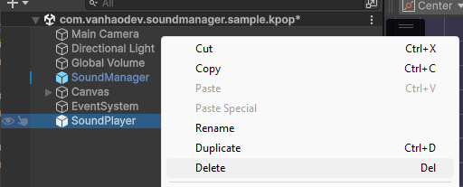

7. Assign the prefab to **Sound Player Prefab** in `SoundManager`

   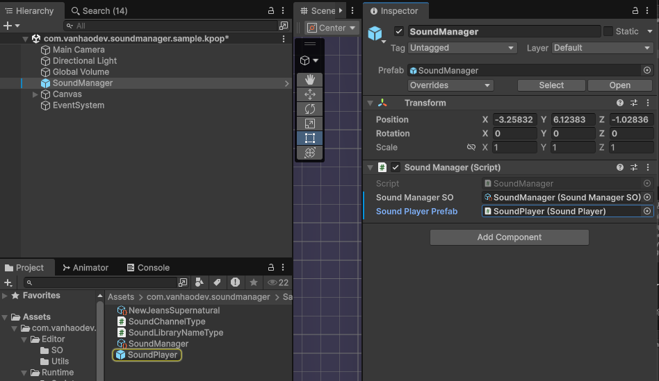

---

## 6. Example Usage

This example shows a simple use case:

* Play background music (Music)
* Play sound effects (SFX)
* Switch music
* Control volume in realtime

---

### 🎧 Enums

```csharp
public enum SoundLibraryNameType
{
    NewJeansSupernatural = 0,
}

public enum SoundChannelType
{
    Music = 0,
    SFX = 1,
}
```

---

### 🎮 Sample Code

```csharp
using UnityEngine;

public class SoundExample : MonoBehaviour
{
    [SerializeField] private SoundManager _soundManager;

    private int _musicPlayId = -1;

    // 🔊 Play SFX (click, hit, UI...)
    public void PlaySFX()
    {
        _soundManager.PlayOneShot(
            (int)SoundLibraryNameType.NewJeansSupernatural,
            (int)SoundChannelType.SFX
        );
    }

    // 🎵 Play background music
    public void PlayMusic()
    {
        if (_musicPlayId != -1) return;

        _musicPlayId = _soundManager.PlayLoop(
            (int)SoundLibraryNameType.NewJeansSupernatural,
            (int)SoundChannelType.Music
        );
    }

    // ⏹ Stop music
    public void StopMusic()
    {
        if (_soundManager.StopByPlayId(_musicPlayId))
        {
            _musicPlayId = -1;
        }
    }

    // 🔄 Clear system
    public void ClearAll()
    {
        _soundManager.Clear(true);
        _musicPlayId = -1;
    }
}
```

---

### 🎚 Volume Control (Realtime)

```csharp
// Master volume (whole game)
_soundManager.SetMasterVolume(0.5f);
_soundManager.RefreshVolumeAllChannels();

// Per channel volume
_soundManager.SetChannelVolume((int)SoundChannelType.Music, 0.3f);
_soundManager.RefreshVolume((int)SoundChannelType.Music);
```

---

### 💡 Best Practice

* Use `PlayLoop` for **Music**
* Use `PlayOneShot` for **SFX**
* Always store `playId` if you need to stop a sound
* After changing volume → call `RefreshVolume`
* Call `Clear()` after a sound-heavy scene to free unused SoundPlayers and return them to the pool.

---

## Audio Load Types

Sound Manager supports 3 different ways to load audio clips, allowing you to optimize memory usage based on your needs.

### Load Type Options

| Load Type | RAM Usage | Use Case |
|-----------|-----------|----------|
| **Direct** | High (loaded on startup) | Short SFX, frequently played sounds |
| **Resources** | On-demand | Medium-length sounds, voice clips |
| **Addressables** | On-demand + unload | Large music files, streaming audio |

### 1. Direct (Default)

Audio clip is referenced directly and loaded into RAM when the game starts.

- **Pros**: Instant playback, no loading delay
- **Cons**: Uses RAM even when not playing
- **Best for**: UI sounds, short SFX

### 2. Resources

Audio clip is loaded from the `Resources` folder when needed.

- **Pros**: Reduced initial memory, simple setup
- **Cons**: Files must be in Resources folder
- **Best for**: Voice clips, medium-length sounds

**Setup:**
1. Place your audio file in a `Resources` folder (e.g., `Assets/Resources/Audio/Music/MainTheme.wav`)
2. Set **Load Type** to `Resources`
3. Enter the path without extension: `Audio/Music/MainTheme`

### 3. Addressables (Advanced)

Audio clip is loaded via Unity Addressables system for maximum control.

- **Pros**: Full control over load/unload, best for large projects
- **Cons**: Requires Addressables package setup
- **Best for**: Background music, large audio files

**Setup:**
1. Install **Addressables** package from Package Manager
2. Add `ADDRESSABLES_SUPPORT` to Scripting Define Symbols:
   - Edit → Project Settings → Player → Scripting Define Symbols
3. Mark your audio files as Addressable
4. Set **Load Type** to `Addressables`
5. Assign the Addressable Reference

### Preloading & Unloading

For `Resources` and `Addressables` load types, you can preload clips to avoid delay:

```csharp
// Preload a single clip
_soundManager.PreloadClip((int)SoundLibraryNameType.MainTheme, () => {
    Debug.Log("Clip ready!");
});

// Preload multiple clips
_soundManager.PreloadClips(new int[] {
    (int)SoundLibraryNameType.MainTheme,
    (int)SoundLibraryNameType.BattleMusic
}, () => {
    Debug.Log("All clips ready!");
});

// Unload when no longer needed
_soundManager.UnloadClip((int)SoundLibraryNameType.MainTheme);
```

### When to Unload?

Choose based on how the sound is used:

| Usage Pattern | Load Type | Unload Strategy |
|---------------|-----------|-----------------|
| **Frequent, short** (UI click, hit) | Direct | Don't unload |
| **Occasional, medium** (voice, skill) | Resources | Unload after usage batch |
| **Rare, long** (BGM, cutscene) | Resources/Addressables | Unload when finished |

**Simple rules:**
- Play **many times/second** → keep in RAM (Direct)
- Play **few times/minute** → load when needed, unload when idle
- Play **once/scene** → unload immediately after

**Example - Switching music:**
```csharp
public void SwitchMusic(int newMusicIndex)
{
    int oldMusic = _currentMusicIndex;
    
    // Stop old music first
    _soundManager.StopByPlayId(_bgmPlayId);
    
    // Play new music
    _bgmPlayId = _soundManager.PlayLoop(newMusicIndex);
    _currentMusicIndex = newMusicIndex;
    
    // Unload old music AFTER playing new one
    _soundManager.UnloadClip(oldMusic);
}
```

> **Note:** Mobile devices need more aggressive unloading than PC due to RAM constraints.

### Callback-based Play

If you need to know when the sound actually starts playing:

```csharp
_soundManager.PlayLoop(
    (int)SoundLibraryNameType.MainTheme,
    (int)SoundChannelType.Music,
    playId => {
        if (playId == -1)
            Debug.LogError("Failed to load clip!");
        else
            Debug.Log($"Playing with ID: {playId}");
    }
);
```

---

### 🧪 Debug

```csharp
Debug.Log(_soundManager.Dump());
```

Shows all currently playing sounds by channel (useful for debugging)

---
