# Sound Manager Guide

You can import the sample **K-pop Festival** from Package Manager to quickly understand how things work, since it already includes ready-to-use `SoundManagerSO` and `SoundClipSO`.

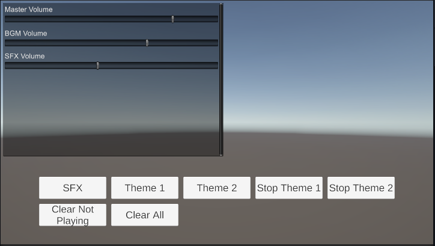

---

_Before following this guide, please delete the **K-pop Festival** sample to avoid conflicts when creating a new `SoundManagerSO`._

---

## 1. Step 1
Find the prefab named **SoundManager** and drag it into your Scene.

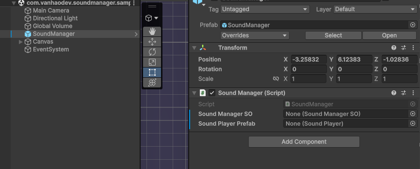

_You can also create an empty GameObject and manually add the `SoundManager` component instead of using the prefab._

---

## 2. Step 2
Right-click in any folder → Create a new **SoundManagerSO**

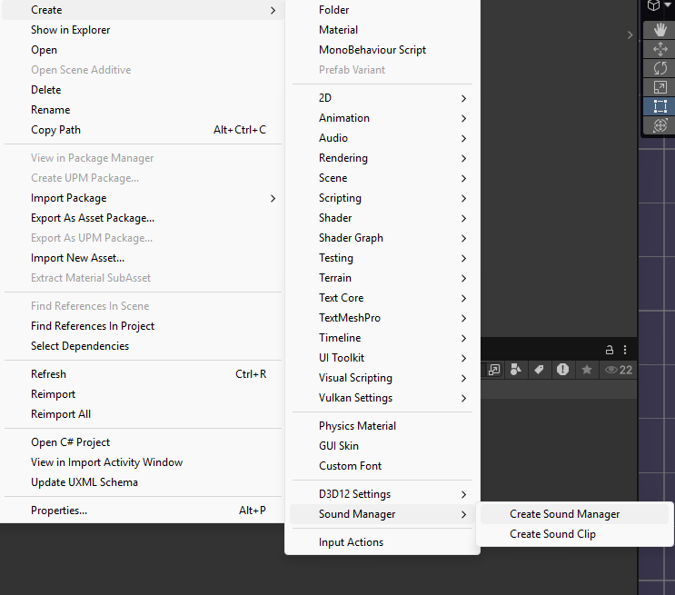

_A new `SoundManagerSO` will appear in your folder_

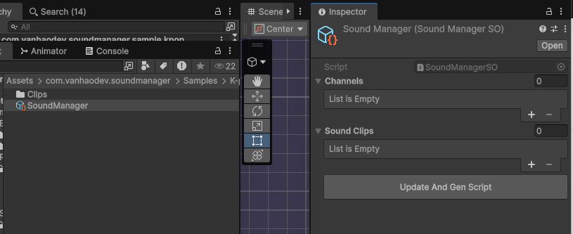

_Add 2 channels: **Music** and **SFX**, then click **Update And Gen Script**_

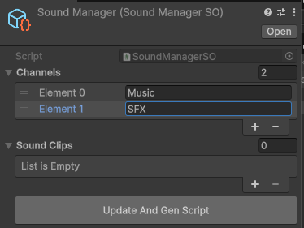

---

## 3. Step 3
Now create a `SoundClipSO` to store your sound/music.

Right-click in any folder → Create **SoundClipSO**

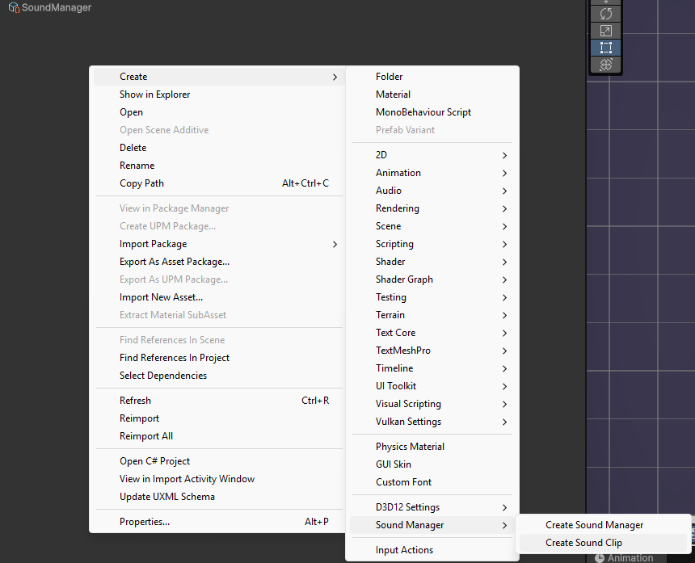

_Add your audio clip and rename the SO to something easy to remember_

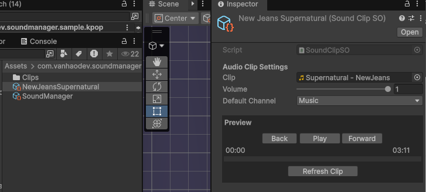

_Click **Refresh Clip** to preview the sound_

**Fields explanation:**
1. **Load Type**: How to load the audio clip (see [Audio Load Types](#audio-load-types) section)
2. **Audio Clip / Resources Path / Addressable Reference**: Depends on Load Type
3. **Volume**: Adjust the volume of this clip  
   - Example: background sounds (like birds) should be lower than 1  
4. **Default Channel**:  
   - Groups sounds into channels (Music, SFX, etc.)  
   - Sounds in the same channel share the same volume control  

**Dynamic channel example:**
- You create an explosion sound and set default channel = SFX  
- Later, you add a new channel called `UISound`  
- In a shop UI, you want to preview the explosion sound  
→ You can play it using `UISound` instead of SFX at runtime  

---

## 4. Step 4
Add your `SoundClipSO` (e.g. *NewJeansSupernatural*) into the sound library inside `SoundManagerSO`, then click **Update And Gen Script**

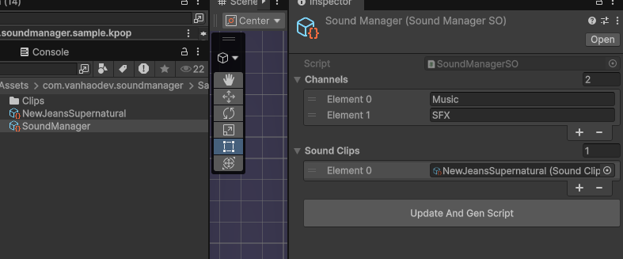

_This will generate/update 2 enum scripts:_

- `SoundChannelType`
- `SoundLibraryNameType`

```csharp
public enum SoundChannelType
{
    Music = 0,
    SFX = 1,
}
````

```csharp
public enum SoundLibraryNameType
{
    NewJeansSupernatural = 0,
}
```

*This means your system now has 2 channels and 1 sound clip ready to use.*

---

## 5. Step 5

Go back to the Scene and assign your `SoundManagerSO` to the **SoundManager** component.

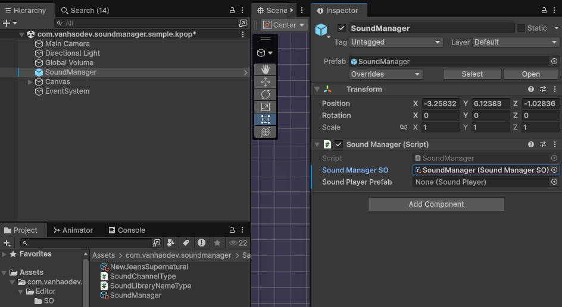

*You will see that `SoundManager` still needs a `SoundPlayer` prefab.*

### Create SoundPlayer prefab:

1. Create a new GameObject → rename it to **SoundPlayer**

   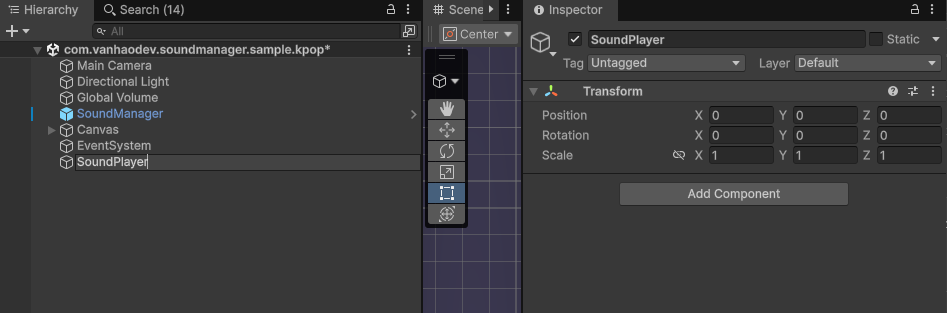

2. Add component → **Audio Source**

   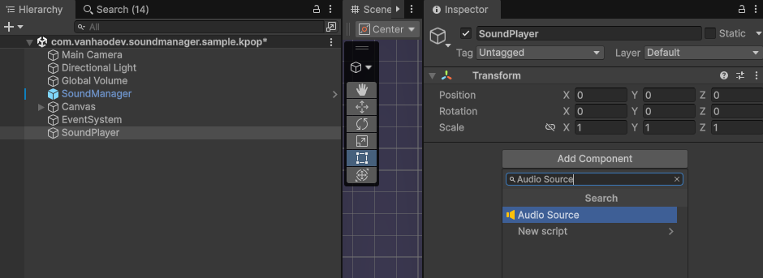

3. Add component → **SoundPlayer**

   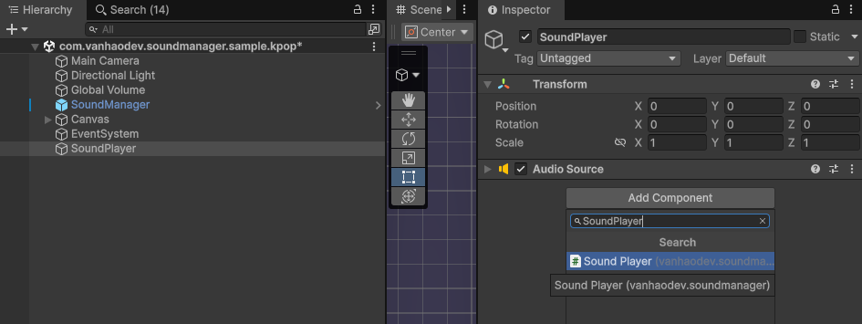

4. Drag **Audio Source** into the **Audio Source** field of `SoundPlayer`

   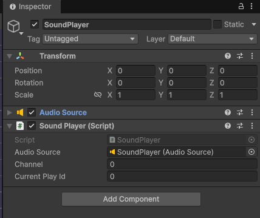

5. Drag this GameObject into a folder to create a prefab

   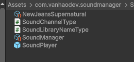

6. Delete it from the Scene (the prefab is already saved)

   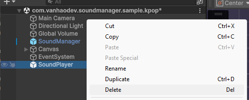

7. Assign the prefab to **Sound Player Prefab** in `SoundManager`

   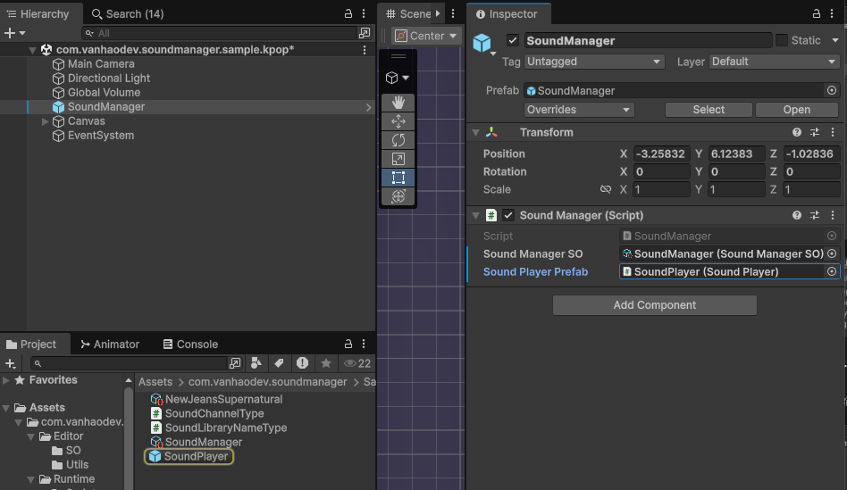

---

## 6. Example Usage

This example shows a simple use case:

* Play background music (Music)
* Play sound effects (SFX)
* Switch music
* Control volume in realtime

---

### 🎧 Enums

```csharp
public enum SoundLibraryNameType
{
    NewJeansSupernatural = 0,
}

public enum SoundChannelType
{
    Music = 0,
    SFX = 1,
}
```

---

### 🎮 Sample Code

```csharp
using UnityEngine;

public class SoundExample : MonoBehaviour
{
    [SerializeField] private SoundManager _soundManager;

    private int _musicPlayId = -1;

    // 🔊 Play SFX (click, hit, UI...)
    public void PlaySFX()
    {
        _soundManager.PlayOneShot(
            (int)SoundLibraryNameType.NewJeansSupernatural,
            (int)SoundChannelType.SFX
        );
    }

    // 🎵 Play background music
    public void PlayMusic()
    {
        if (_musicPlayId != -1) return;

        _musicPlayId = _soundManager.PlayLoop(
            (int)SoundLibraryNameType.NewJeansSupernatural,
            (int)SoundChannelType.Music
        );
    }

    // ⏹ Stop music
    public void StopMusic()
    {
        if (_soundManager.StopByPlayId(_musicPlayId))
        {
            _musicPlayId = -1;
        }
    }

    // 🔄 Clear system
    public void ClearAll()
    {
        _soundManager.Clear(true);
        _musicPlayId = -1;
    }
}
```

---

### 🎚 Volume Control (Realtime)

```csharp
// Master volume (whole game)
_soundManager.SetMasterVolume(0.5f);
_soundManager.RefreshVolumeAllChannels();

// Per channel volume
_soundManager.SetChannelVolume((int)SoundChannelType.Music, 0.3f);
_soundManager.RefreshVolume((int)SoundChannelType.Music);
```

---

### 💡 Best Practice

* Use `PlayLoop` for **Music**
* Use `PlayOneShot` for **SFX**
* Always store `playId` if you need to stop a sound
* After changing volume → call `RefreshVolume`
* Call `Clear()` after a sound-heavy scene to free unused SoundPlayers and return them to the pool.

---

## Audio Load Types

Sound Manager supports 3 different ways to load audio clips, allowing you to optimize memory usage based on your needs.

### Load Type Options

| Load Type | RAM Usage | Use Case |
|-----------|-----------|----------|
| **Direct** | High (loaded on startup) | Short SFX, frequently played sounds |
| **Resources** | On-demand | Medium-length sounds, voice clips |
| **Addressables** | On-demand + unload | Large music files, streaming audio |

### 1. Direct (Default)

Audio clip is referenced directly and loaded into RAM when the game starts.

- **Pros**: Instant playback, no loading delay
- **Cons**: Uses RAM even when not playing (unless you unload its audio data)
- **Best for**: UI sounds, short SFX

The clip file is always part of the build. `PreloadClip`/`UnloadClip` load or free its **audio data** in RAM
(`AudioClip.LoadAudioData`/`UnloadAudioData`); see [Audio Import Settings](#audio-import-settings).

### 2. Resources

Audio clip is loaded from the `Resources` folder when needed.

- **Pros**: Reduced initial memory, simple setup
- **Cons**: Files must be in Resources folder
- **Best for**: Voice clips, medium-length sounds

**Setup:**
1. Place your audio file in a `Resources` folder (e.g., `Assets/Resources/Audio/Music/MainTheme.wav`)
2. Set **Load Type** to `Resources`
3. Drag the clip into **Audio Clip**, the path is filled in for you: `Audio/Music/MainTheme`
   - Or type the path relative to `Resources`, without extension
   - Only the path is saved, so the SO holds no reference to the clip

### 3. Addressables (Advanced)

Audio clip is loaded via Unity Addressables system for maximum control.

- **Pros**: Full control over load/unload, best for large projects
- **Cons**: Requires Addressables package setup
- **Best for**: Background music, large audio files

**Setup:**
1. Install **Addressables** package from Package Manager
   - Support is detected automatically, no Scripting Define Symbol needed
2. Mark your audio files as Addressable
3. Set **Load Type** to `Addressables`
4. Assign the Addressable Reference

**Try it in the K-pop Festival sample:**
1. Install **Addressables** package from Package Manager
2. Select `AddressableAudios/bell.wav` in the imported sample and tick **Addressable** in the Inspector
3. Play the scene and press **SFX (Addressables)**

_Without Addressables installed the sample still compiles; the button only logs a warning._

### Audio Import Settings

Select an audio file in the Project window to see these in the Inspector.
They decide how Unity keeps the sound in memory, on top of the Load Type chosen in `SoundClipSO`.

| Setting | What it does |
|---------|--------------|
| **Force To Mono** | Mixes stereo into one channel, halving memory. Fine for most SFX. |
| **Normalize** | Shown with Force To Mono: raises the volume to full after mixing. |
| **Load In Background** | On: audio data loads without freezing the game, ready a few frames later. Off: loads instantly but can stall a frame on big files. |
| **Ambisonic** | Only for 360°/VR ambisonic recordings. Leave off. |
| **Load Type** | **Decompress On Load**: stored fully decoded in RAM (most RAM, least CPU). **Compressed In Memory**: kept compressed, decoded while playing (less RAM, more CPU). **Streaming**: read from disk while playing (almost no RAM). |
| **Preload Audio Data** | On: audio data loads together with the scene or asset that references the clip. Off: loads on first play or when you preload it. |
| **Compression Format** | **PCM**: uncompressed, largest. **Vorbis**: small, adjust with Quality. **ADPCM**: medium size, cheap to decode, good for short noisy SFX. |
| **Quality** | Vorbis only: lower means a smaller file. |
| **Sample Rate Setting** | Lowering the sample rate shrinks the file at the cost of high frequencies. |

How they affect Sound Manager (checked in Unity 6000.3):

- **Preload Audio Data on**: a Direct clip is loaded when the scene loads, so it plays at once without a warning.
- **Preload Audio Data off**: a Direct clip starts unloaded. Call `PreloadClip` first, otherwise it plays late with a warning and joins "AutoLoaded".
- **Load In Background on**: `PreloadClip`'s callback fires a few frames later, when the data is ready. Off: it fires immediately.
- `UnloadClip` stops the sound if it is playing, then frees the data. The next play or preload brings it back.

Suggested presets:

| Sound | Load Type | Preload Audio Data | Load In Background | Compression |
|-------|-----------|--------------------|--------------------|-------------|
| UI click, hit, footsteps (short, frequent) | Decompress On Load | On | Off | ADPCM or Vorbis |
| Voice, skills, medium SFX | Compressed In Memory | Off (preload when needed) | On | Vorbis |
| Background music, long ambience | Streaming | Off | On | Vorbis |

The K-pop Festival sample follows these presets: `bell.wav` uses the first row, the two music tracks use the last row.

### Preloading & Unloading

Preload clips to avoid delay (Direct clips load their audio data, Resources/Addressables clips load the asset):

```csharp
// Preload a single clip
_soundManager.PreloadClip((int)SoundLibraryNameType.MainTheme, () => {
    Debug.Log("Clip ready!");
});

// Preload multiple clips
_soundManager.PreloadClips(new int[] {
    (int)SoundLibraryNameType.MainTheme,
    (int)SoundLibraryNameType.BattleMusic
}, () => {
    Debug.Log("All clips ready!");
});

// Unload when no longer needed (Resources: unload, Addressables: release)
_soundManager.UnloadClip((int)SoundLibraryNameType.MainTheme);

// Unload the same group you preloaded
_soundManager.UnloadClips(new int[] {
    (int)SoundLibraryNameType.MainTheme,
    (int)SoundLibraryNameType.BattleMusic
});

// Unload every Resources/Addressables clip at once, e.g. when leaving a level
_soundManager.UnloadAllClips();
```

Nothing is unloaded automatically: you decide what to free and when. A typical pattern:

```csharp
int[] _bossSounds = { (int)SoundLibraryNameType.BossTheme, (int)SoundLibraryNameType.BossRoar };

void EnterBossFight() => _soundManager.PreloadClips(_bossSounds, StartFight);
void ExitBossFight()  => _soundManager.UnloadClips(_bossSounds);
```

- Calling play/preload several times while a clip is still loading shares a single load.
- `UnloadClip` stops any sound still playing that clip before unloading it.
- `UnloadClip` during loading is honored: the clip is released as soon as the load finishes.

### Available Sounds

Check which sounds can play right away (their clip is loaded; for Direct clips, their audio data is loaded):

```csharp
bool ready = _soundManager.IsClipLoaded((int)SoundLibraryNameType.BossTheme);
List<int> available = _soundManager.GetAvailableSounds();
```

### Sound Groups (optional)

Groups are optional: preloading and playing work the same whether you use them or not.
Put sounds in a group when you preload them, then unload the whole group in one call:

```csharp
// Preload and put in a group in one statement
_soundManager.PreloadClip((int)SoundLibraryNameType.BossTheme).AddToGroup("Boss");
_soundManager.PreloadClips(_bossSounds, StartFight).AddToGroup("Boss");

// Sounds of the group that can play right away
List<int> bossReady = _soundManager.Groups.GetAvailableSounds("Boss");

// Unload/release the whole group
_soundManager.Groups.Unload("Boss");
```

- A sound only joins a group by being preloaded with `.AddToGroup(...)`.
- A sound belongs to one group only: preloading it into another group moves it out of the old one.
- `Unload` unloads every sound currently in the group.
- `_soundManager.Groups.GetGroup(id)` tells which group a sound is in (`null` if none).

### Playing Without Preloading

Playing a sound that isn't loaded still works: it loads first, then plays a bit late.
This covers Resources/Addressables clips that were never loaded or were unloaded, and Direct clips whose audio data
isn't loaded (imported without "Preload Audio Data", or freed with `UnloadClip`).
To help you spot these, the sound manager:

- Logs a warning (Editor and Development builds only), once per load.
- Moves the sound to the `SoundGroups.AutoLoadedGroup` group ("AutoLoaded"), even if it was in another group before
  (e.g. preloaded into "Boss", unloaded with `UnloadClip`, then played again).

```csharp
// Which sounds were played without preloading, and are loaded right now
List<int> missed = _soundManager.Groups.GetAvailableSounds(SoundGroups.AutoLoadedGroup);

// Free all of them at once
_soundManager.Groups.Unload(SoundGroups.AutoLoadedGroup);
```

Preloading the sound later (e.g. `.AddToGroup("Boss")`) moves it out of "AutoLoaded".

### When to Unload?

Choose based on how the sound is used:

| Usage Pattern | Load Type | Unload Strategy |
|---------------|-----------|-----------------|
| **Frequent, short** (UI click, hit) | Direct | Don't unload, or unload its audio data when leaving the scene that uses it |
| **Occasional, medium** (voice, skill) | Resources | Unload after usage batch |
| **Rare, long** (BGM, cutscene) | Resources/Addressables | Unload when finished |

**Simple rules:**
- Play **many times/second** → keep in RAM (Direct)
- Play **few times/minute** → load when needed, unload when idle
- Play **once/scene** → unload immediately after

**Example - Switching music:**
```csharp
public void SwitchMusic(int newMusicIndex)
{
    int oldMusic = _currentMusicIndex;
    
    // Stop old music first
    _soundManager.StopByPlayId(_bgmPlayId);
    
    // Play new music
    _bgmPlayId = _soundManager.PlayLoop(newMusicIndex);
    _currentMusicIndex = newMusicIndex;
    
    // Unload old music AFTER playing new one
    _soundManager.UnloadClip(oldMusic);
}
```

> **Note:** Mobile devices need more aggressive unloading than PC due to RAM constraints.

### Callback-based Play

If you need to know when the sound actually starts playing:

```csharp
_soundManager.PlayLoop(
    (int)SoundLibraryNameType.MainTheme,
    (int)SoundChannelType.Music,
    playId => {
        if (playId == -1)
            Debug.LogError("Failed to load clip!");
        else
            Debug.Log($"Playing with ID: {playId}");
    }
);
```

---

### 🧪 Debug

```csharp
Debug.Log(_soundManager.Dump());
```

Shows all currently playing sounds by channel (useful for debugging)

---
